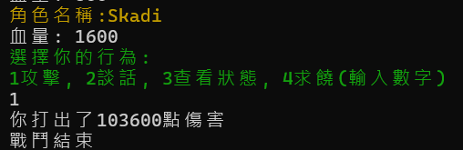

# 組別號碼: 8
### 系級班級:1A 1A 4B
### 成員資訊：曹允杰(組長)、阮琮勛、王邦宇
### 小專題題目: Pitiable shark's adventure in different world
# 程式介紹:
遊戲為回合制戰鬥遊戲，多結局，採古老的你一拳我一拳的方式戰鬥。同時玩家可以自訂名稱(僅限英文)。  
玩家需要挑戰三個BOSS，如果不運用智慧，將無法通關。  
本遊戲採劇情式引導教學。
# 程式規則:
玩家與怪物(BOSS)血量乃劇本預先設定，根據後續行為會進行隨機挑整。  
1. 攻擊
     1. 玩家可對怪物進行攻擊。
     2. 不論玩家行動與否，怪物都會進行攻擊。
2. 交談
     1. 玩家可與怪物進行談話。
     2. 怪物有權力拒絕溝通。
3. 查看狀態
    1. 玩家可以使用此功能來查看敵我雙方的血量。
    2. 不可查看雙方攻擊力，只能親身體會。
4. 求饒
     1. 玩家可以對怪物進行求饒。
     2. 此時玩家將會放棄行動權。
5. 血量
     1. 當玩家血量小於0時，遊戲直接結束。
     2. 當怪物血量小於0時，將進行饒恕階段。
6. 饒恕
     1. 玩家可以選擇是否饒恕BOSS。
     2. 饒恕與否將會決定玩家最後的結局走向。
     3. 饒恕怪物後將獲得永久攻擊力提升。
# 程式玩法:
玩家可以在戲統提示輸入時，進行數字輸入，但要注意的是，如果數字輸入超過可輸入最大選項，將視作可選擇之最大選項。
# 程式碼執行方式:
在Releases處下載game-win-x64.zip，解壓縮後執行exe檔案即可。
# 程式碼執行畫面:

# 分工資訊:
資工1A 曹允杰（組長）：第一次上台報告、製作小專題報告檔案以及README.md、開發小專題所有物件以及相關功能、期末成品發表報告。

資工1A 阮琮勛：幫忙取名字、協助製作ppt、未開發任何物件。

資工4B 王邦宇：幫忙取名字、未開發任何物件。
